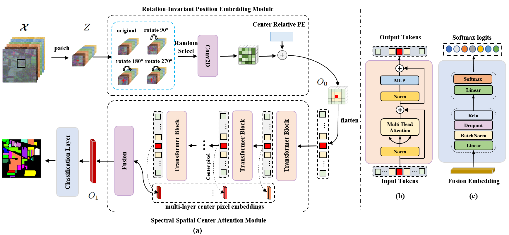

# Spectral Query Spatial: Revisiting the Role of Center Pixel in Transformer for Hyperspectral Image Classiffcation

Ning Chen, Leyuan Fang, Yang Xia, Shaobo Xia, Hui Liu, and Jun Yue
___________

The code in this toolbox implements the ["Spectral Query Spatial: Revisiting the Role of Center Pixel in Transformer for Hyperspectral Image Classiffcation"](https://ieeexplore.ieee.org/document/10419080). 


More specifically, it is detailed as follow.



Citation
---------------------

**Please kindly cite the papers if this code is useful and helpful for your research.**

```
N. Chen, L. Fang, Y. Xia, S. Xia, H. Liu and J. Yue, "Spectral Query Spatial: Revisiting the Role of Center Pixel in Transformer for Hyperspectral Image Classification," in IEEE Transactions on Geoscience and Remote Sensing, vol. 62, pp. 1-14, 2024, Art no. 5402714, doi: 10.1109/TGRS.2024.3361652.}
```

```
@ARTICLE{10419080,
  author={Chen, Ning and Fang, Leyuan and Xia, Yang and Xia, Shaobo and Liu, Hui and Yue, Jun},
  journal={IEEE Transactions on Geoscience and Remote Sensing}, 
  title={Spectral Query Spatial: Revisiting the Role of Center Pixel in Transformer for Hyperspectral Image Classification}, 
  year={2024},
  volume={62},
  number={},
  pages={1-14},
  keywords={Feature extraction;Hyperspectral imaging;Interference;Data mining;Current transformers;Adaptation models;Tokenization;Deep neural network;hyperspectral image (HIS) classification},
  doi={10.1109/TGRS.2024.3361652}}
```


How to use it?
---------------------
1. Prepare HSI datasets, such as IP, PU, WH, etc. Before use, it is necessary to perform train/test splitting. The data format can refer to the provided reference data at *data/Indian/Indian_10_split.mat*. Store the splitted data in the corresponding folders under the data directory. For example, store the IP dataset in *data/Indian*. The file names of the mat files should follow the format *SIGN_NUM_split.mat*, where *SIGN* represents the data identifier and *NUM* represents the number of training samples for each class.

2. Modify the parameters in *src/params_use/sqsformer.json* according to the data file path, mainly for the data_sign and data_file parameters. For example: *data/Indian/Indian_10_split.mat => data/[data_sign]/[data_file]_split.mat*.

3. Run the code.
   ```
   python workflow.py
   ```

Others
----------------------
If you want to run the code in your own data, you can accordingly change the input (e.g., data, labels) and tune the parameters in params_use.

If you encounter the bugs while using this code, please do not hesitate to contact us.

Licensing
---------

Copyright (C) 2024 Ning Chen

This program is free software: you can redistribute it and/or modify it under the terms of the GNU General Public License as published by the Free Software Foundation, version 3 of the License.

This program is distributed in the hope that it will be useful, but WITHOUT ANY WARRANTY; without even the implied warranty of MERCHANTABILITY or FITNESS FOR A PARTICULAR PURPOSE. See the GNU General Public License for more details.

You should have received a copy of the GNU General Public License along with this program.

